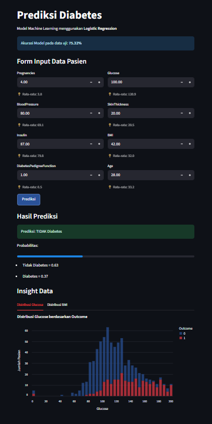

# 🩺 Prediksi Diabetes dengan Machine Learning

Aplikasi berbasis **Streamlit** untuk memprediksi kemungkinan seseorang terkena diabetes menggunakan algoritma **Logistic Regression**. Selain prediksi, aplikasi ini juga menampilkan **visualisasi distribusi data** untuk memberikan insight tambahan.

## 📸 Preview Aplikasi



## 🚀 Fitur Utama

- **Prediksi Diabetes** dengan Logistic Regression
- **Form input modern** dengan placeholder (hint nilai rata-rata) agar mudah diisi
- **Visualisasi data** (distribusi Glucose terhadap Outcome)
- **Akurasi model** ditampilkan secara langsung
- **Tampilan modern & profesional** dengan custom CSS

## 📂 Dataset

Aplikasi menggunakan dataset `Dataset_Diabetes.csv` (Pima Indians Diabetes Dataset). Pastikan file CSV ada di folder project sebelum menjalankan aplikasi.

## ⚙️ Cara Menjalankan

1. **Clone repository ini:**
   ```bash
   git clone https://github.com/username/nama-repo.git
   cd nama-repo
   ```

2. **Buat dan aktifkan virtual environment** (opsional, tapi disarankan):
   ```bash
   python -m venv venv
   venv\Scripts\activate   # Windows
   source venv/bin/activate # Mac/Linux
   ```

3. **Install dependencies:**
   ```bash
   pip install -r requirements.txt
   ```

4. **Jalankan aplikasi Streamlit:**
   ```bash
   streamlit run app.py
   ```

5. **Akses di browser:**
   ```
   http://localhost:8501
   ```

## 📦 Dependencies

Berikut daftar library yang dibutuhkan:

- `streamlit` - Framework untuk membuat web app
- `pandas` - Manipulasi dan analisis data
- `numpy` - Komputasi numerik
- `scikit-learn` - Machine learning algorithms
- `matplotlib` - Visualisasi data
- `seaborn` - Statistical data visualization

**Instalasi otomatis:**
```bash
pip install -r requirements.txt
```

## 🌟 Keunggulan

- **User-friendly** dengan tampilan bersih dan modern
- **Informatif** dengan grafik distribusi data
- **Ringan** & mudah dijalankan di berbagai device
- **Edukatif** - cocok untuk pembelajaran machine learning & data science

## 📝 Lisensi

Project ini dibuat untuk keperluan edukasi. Silakan digunakan, dimodifikasi, dan dikembangkan lebih lanjut.

---

*Dibuat dengan ❤️ menggunakan Streamlit dan Scikit-learn*
